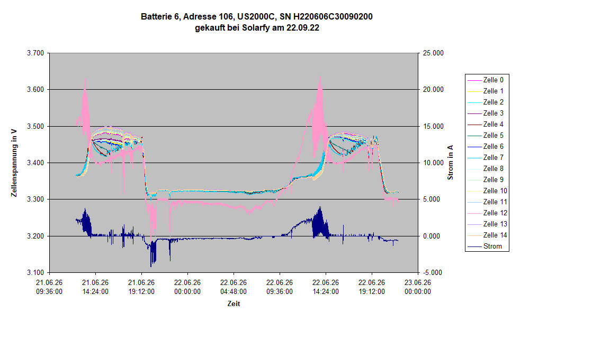

# Pylontech-Battery-Investigation

## Technical investigation of repeated charge interruptions in Pylontech US2000C LiFePO₄ battery modules

| Project information | |
|---|---|
| **Author** | Dr.-Ing. Gerhard Pollak-Diener |
| **Report version** | 1.0 |
| **Language** | German |
| **Publication status** | Public release |
| **Battery type** | Pylontech US2000C |
| **Main topic** | Root cause analysis of repeated charge interruptions |
| **Report format** | PDF |

  

  <em>Figure 1: Cell voltage of the affected cell group and battery current during repeated charge interruptions.</em>

## Overview

This repository contains the results of an experimental investigation
into repeated charge interruptions observed in a stationary energy
storage system equipped with parallel-operated Pylontech battery modules.

The investigation combines:

- Logger data recorded through the serial diagnostic interface
- Analysis of cell-voltage behaviour during charging
- Internal-resistance measurements
- Inspection of opened battery modules
- Analysis of the battery management system
